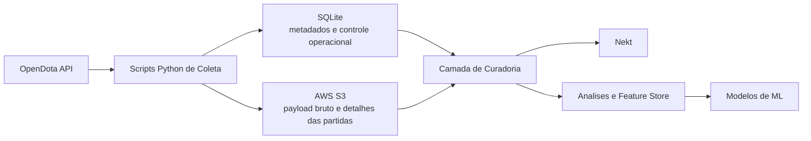

# Téo Me Why - Dota 2

Projeto de coleta, armazenamento, processamento e analise de dados de Dota 2 utilizando a API OpenDota como fonte principal.

Este repositório documenta a arquitetura proposta para construir um pipeline de dados orientado a partidas, com foco em:

- coleta automatizada de dados de partidas, jogadores e campeonatos
- armazenamento operacional em SQLite para metadados e consultas rapidas
- persistencia de dados detalhados em um bucket S3 na AWS
- leitura posterior desses dados pela Nekt
- desenvolvimento de analises exploratorias, feature store e modelos de machine learning

O objetivo final e transformar dados brutos do ecossistema competitivo e publico de Dota 2 em uma base confiavel para exploracao analitica e modelos preditivos.

## Visao Geral

O projeto parte de uma premissa simples: nem todos os dados precisam ficar no mesmo lugar.

Dados menores, relacionais e frequentemente consultados podem ser mantidos em SQLite, como:

- catalogo de partidas coletadas
- status de ingestao
- jogadores monitorados
- torneios acompanhados
- filas de reprocessamento
- metricas resumidas por partida

Dados detalhados, volumosos ou semiestruturados devem ser persistidos no S3, como:

- payload bruto retornado pela OpenDota
- detalhes completos de cada partida
- eventos por jogador
- composicao de draft
- estatisticas por timeline quando disponiveis
- snapshots prontos para consumo analitico

Essa separacao reduz custo operacional local, simplifica o controle do pipeline e cria uma fundacao mais robusta para consumo analitico e treino de modelos.

## Objetivos

- Construir uma base historica de partidas profissionais de Dota 2 com confiabilidade.
- Permitir ingestao incremental e reprocessamento controlado.
- Estruturar uma camada simples de metadados em SQLite.
- Persistir dados ricos de cada partida em S3 para leitura pela Nekt.
- Criar datasets analiticos para exploracao, BI e ML.
- Evoluir para predicao de resultados, desempenho em campeonatos e dinamica de rotacao de jogadores.

## Casos de Uso

O ecossistema de dados deste projeto pode suportar, entre outros, os seguintes casos:

- analise de win rate por heroi, side e patch
- avaliacao de desempenho por jogador e equipe
- monitoramento de tendencias por campeonato
- estudo de drafts e combinacoes de herois
- predicao do vencedor de uma partida antes do inicio
- predicao do desempenho de uma equipe em um torneio
- identificacao de mudancas de roster com maior impacto competitivo
- construcao de indicadores de sinergia entre jogadores

## Arquitetura Proposta

## Roadmap Sugerido

As fases abaixo organizam a evolucao do projeto e servem como indice para as secoes seguintes:

| Fase | Objetivo | Principais frentes | Entregaveis esperados |
| --- | --- | --- | --- |
| 1. Fundacao | estabelecer a base operacional do projeto e a primeira coleta confiavel | configurar projeto Python; criar cliente da OpenDota; definir schema SQLite; criar rotina de coleta incremental | estrutura inicial do repositorio; configuracao de ambiente e credenciais; script funcional de ingestao incremental; banco SQLite com tabelas operacionais |
| 2. Data Lake | separar armazenamento operacional de armazenamento detalhado e permitir reprocessamento | persistir payload bruto no S3; padronizar paths e particionamento; adicionar transformacao para dados bronze | bucket e convencoes de path definidas; gravacao de JSON bruto por partida; primeira camada bronze pronta para consumo posterior |
| 3. Analitica | transformar dados coletados em ativos analiticos reutilizaveis | produzir datasets para exploracao; integrar leitura pela Nekt; criar indicadores de performance | tabelas derivadas por partida, jogador, time e campeonato; consumo validado pela Nekt; indicadores iniciais para exploracao e monitoramento |
| 4. ML | evoluir da analise descritiva para predicao e apoio a decisao | construir pipeline de features; treinar baseline de predicao de partidas; evoluir para modelos de campeonato e rotacao | dataset de treino versionado; baseline reprodutivel de predicao; trilha aberta para modelos mais especializados |

## Trilha de Machine Learning

O projeto pode evoluir em camadas de maturidade.

| Fase | Objetivo |
| --- | --- |
| Predicao de resultado de partida | prever vitoria ou derrota antes do inicio da partida ou a partir do draft |
| Predicao de desempenho em campeonatos | estimar classificacao, avancos em brackets ou expectativa de vitorias |
| Análise de rotacao de jogadores | entender impacto de entrada e saida de jogadores em uma equipe |

## Limitacoes e Cuidados

- a OpenDota pode ter limites de taxa e cobertura variavel conforme o endpoint;
- nem toda partida possui o mesmo nivel de detalhamento disponivel;
- dados competitivos mudam rápido com patches e alteracoes de roster;
- modelos podem degradar com o tempo e exigem retreino recorrente;

